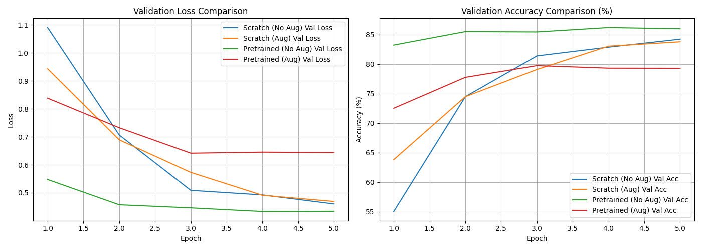
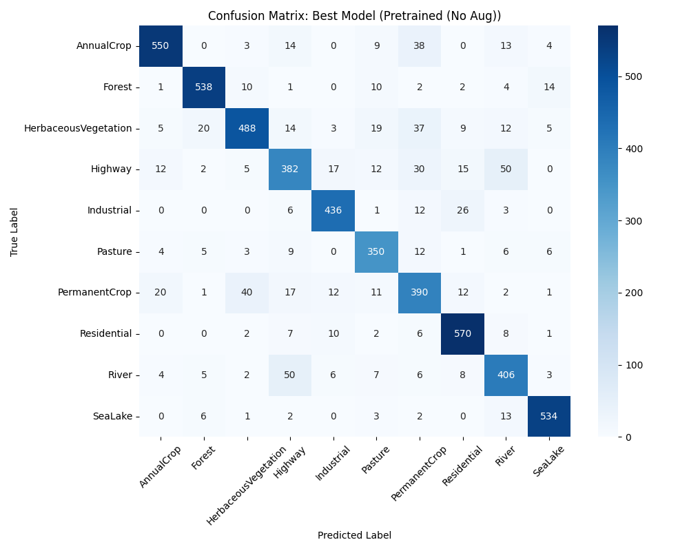

# acm_task2_ojas
# Project Sentinel — Satellite Wing Field Report

## Overview
This project evaluates land-cover and land-use satellite image classification using the EuroSAT RGB dataset (10 classes). We compare a Convolutional Neural Network (TinyVGG) trained from scratch against a fine-tuned pretrained model (ResNet-18), both with and without data augmentation.

## Model Architectures Evaluated
1. **Scratch CNN (TinyVGG)**: A custom 4-layer convolutional neural network trained from scratch.
2. **Transfer Learning (ResNet-18)**: Pretrained on ImageNet with frozen feature layers and a retrained 10-class linear head.

## Diagnostic Visualizations

### 1. Training & Validation Curves

### 2. Best Model Confusion Matrix

